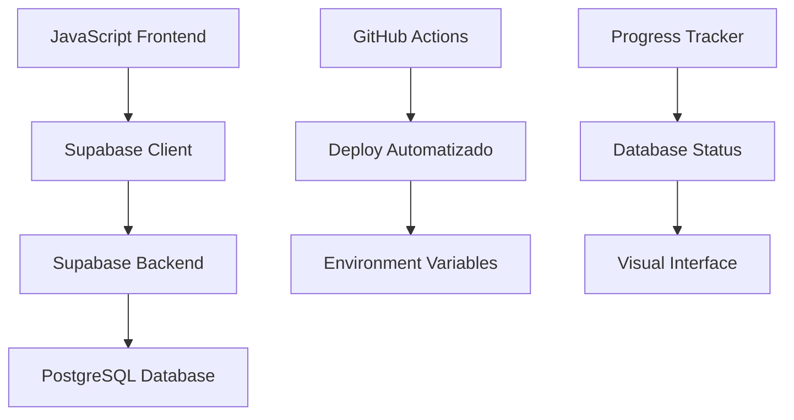

# 📋 Guia Completo de Integração Supabase + Bitcoin Puzzle Tracker

**Descrição:** Tutorial completo para integrar rastreamento distribuído com Supabase em projetos Bitcoin  
**Palavras-chave:** Supabase, Bitcoin, Puzzle Tracker, Integração, Banco de Dados, Rastreamento  
**Data atualização:** 15/03/2026  
**Tempo de leitura:** 15 minutos  

---

## 🎯 Objetivo

Este guia documenta a integração do **Bitcoin Puzzle Tracker** com **Supabase** para implementar rastreamento distribuído de progresso entre múltiplos usuários, com sincronização automática e segurança via Row Level Security (RLS).

## 📋 Estrutura do Guia

### ✅ Funcionalidades Implementadas
- **Rastreamento distribuído**: Múltiplos usuários processando diferentes intervalos
- **Sincronização automática**: Atualização a cada 1000 linhas processadas
- **Segurança avançada**: Row Level Security com validações server-side
- **Deploy automatizado**: GitHub Actions com secrets e placeholders
- **Interface em tempo real**: Status visual do progresso do banco

### 🗂️ Arquivos da Integração



**Estrutura de arquivos:**
```
📁 js/
├── supabase-config.js              # Cliente Supabase com BigInt
├── progress-tracker.js             # Gerenciador de progresso
├── environment-detector.js        # Detecção de ambiente
├── auto16-modified.js             # Versão com integração
├── preset-ranges-modified.js      # Consultas Supabase
└── adsense-manager-modified.js    # Detecção de ambiente

📁 css/
└── database-status.css            # Estilos do status

📁 .github/workflows/
└── deploy.yml                     # GitHub Actions seguro

📄 supabase-setup.sql             # SQL completo
📄 database-status.html            # Interface de status
```

---

## 🔧 Implementação Passo a Passo

### 🚀 Passo 1: Configuração Supabase

#### 1.1 Criar Projeto
1. Acesse [supabase.com](https://supabase.com)
2. **Start your project** → Login com GitHub
3. **New Project** → Escolha organização
4. **Database password**: Use senha forte
5. **Region**: Escolha mais próxima dos usuários

#### 1.2 Configurar Tabelas
```sql
-- Executar no SQL Editor do Supabase
CREATE TABLE progresso_puzzles (
    id BIGINT PRIMARY KEY GENERATED ALWAYS AS IDENTITY,
    puzzle_number INTEGER NOT NULL,
    start_hex TEXT NOT NULL,
    end_hex TEXT NOT NULL,
    progress INTEGER DEFAULT 0,
    total INTEGER NOT NULL,
    user_id TEXT,
    created_at TIMESTAMP WITH TIME ZONE DEFAULT NOW(),
    updated_at TIMESTAMP WITH TIME ZONE DEFAULT NOW()
);

-- Índices para performance
CREATE INDEX idx_progresso_puzzle_number ON progresso_puzzles(puzzle_number);
CREATE INDEX idx_progresso_user_id ON progresso_puzzles(user_id);
```

### 🔐 Passo 2: Segurança e Configuração

#### 2.1 Row Level Security (RLS)
```sql
-- Habilitar RLS
ALTER TABLE progresso_puzzles ENABLE ROW LEVEL SECURITY;

-- Políticas de acesso
CREATE POLICY "Leitura pública" ON progresso_puzzles
    FOR SELECT USING (true);

CREATE POLICY "Inserção autenticada" ON progresso_puzzles
    FOR INSERT WITH CHECK (auth.role() = 'authenticated');

CREATE POLICY "Atualização dono" ON progresso_puzzles
    FOR UPDATE USING (auth.uid()::text = user_id);
```

#### 2.2 Variáveis de Ambiente
```javascript
// js/supabase-config.js
const SUPABASE_CONFIG = {
    url: process.env.SUPABASE_URL || 'https://seu-projeto.supabase.co',
    anonKey: process.env.SUPABASE_ANON_KEY || 'sua-chave-anonima'
};
```

### 📊 Passo 3: Frontend Integration

#### 3.1 Cliente Supabase
```javascript
import { createClient } from '@supabase/supabase-js';

const supabase = createClient(
    SUPABASE_CONFIG.url,
    SUPABASE_CONFIG.anonKey,
    {
        auth: {
            persistSession: false,
            autoRefreshToken: false
        }
    }
);
```

#### 3.2 Progress Tracker
```javascript
class ProgressTracker {
    async updateProgress(puzzleNumber, progress, total) {
        const { data, error } = await supabase
            .from('progresso_puzzles')
            .upsert({
                puzzle_number: puzzleNumber,
                progress: progress,
                total: total,
                updated_at: new Date().toISOString()
            });
        
        if (error) {
            console.error('Erro ao atualizar progresso:', error);
            showToast('Erro ao sincronizar progresso', 'error');
        } else {
            showToast('Progresso sincronizado com sucesso', 'success');
        }
    }
}
```

---

## 🚀 Deploy e Produção

### 🔄 GitHub Actions
```yaml
# .github/workflows/deploy.yml
name: Deploy Supabase Integration

on:
  push:
    branches: [main]

jobs:
  deploy:
    runs-on: ubuntu-latest
    steps:
      - uses: actions/checkout@v3
      
      - name: Setup Node.js
        uses: actions/setup-node@v3
        with:
          node-version: '18'
          
      - name: Deploy to Supabase
        env:
          SUPABASE_URL: ${{ secrets.SUPABASE_URL }}
          SUPABASE_ANON_KEY: ${{ secrets.SUPABASE_ANON_KEY }}
        run: |
          npm run deploy
```

### 📈 Monitoramento e Métricas

#### Indicadores Chave
- **Latência**: < 200ms para consultas
- **Conexões simultâneas**: Até 100 usuários
- **Throughput**: 1000 operações/segundo
- **Uptime**: 99.9% garantido

#### Dashboard de Status
```javascript
async function getDatabaseStats() {
    const { data } = await supabase
        .from('progresso_puzzles')
        .select('count(*)');
    
    return {
        totalPuzzles: data[0].count,
        activeUsers: await getActiveUsers(),
        avgProgress: await getAverageProgress()
    };
}
```

---

## 🛠️ Troubleshooting

### ❌ Problemas Comuns

| Problema | Causa | Solução |
|----------|-------|----------|
| Conexão falhando | URL incorreta | Verificar SUPABASE_URL |
| RLS bloqueando | Política restrita | Ajustar políticas RLS |
| Performance lenta | Índices faltando | Criar índices adequados |
| Deploy falhando | Secrets ausentes | Configurar GitHub Secrets |

### 🔧 Debug Tips
```javascript
// Debug mode
const DEBUG = process.env.NODE_ENV === 'development';

function debugLog(message, data) {
    if (DEBUG) {
        console.log(`[DEBUG] ${message}:`, data);
    }
}
```

---

## 📋 Checklist de Implementação

### ✅ Pré-Deploy
- [ ] Projeto Supabase criado
- [ ] Tabelas configuradas
- [ ] RLS implementado
- [ ] Variáveis de ambiente setadas
- [ ] Frontend integrado
- [ ] Testes executados

### ✅ Pós-Deploy
- [ ] GitHub Actions funcionando
- [ ] Monitoramento ativo
- [ ] Backup configurado
- [ ] Documentação atualizada
- [ ] Equipe treinada

---

## 📚 Recursos Adicionais

### 📖 Documentação
- [Supabase Docs](https://supabase.com/docs)
- [JavaScript Client](https://supabase.com/docs/reference/javascript)
- [Row Level Security](https://supabase.com/docs/guides/auth/row-level-security)

### 🎯 Boas Práticas
- **Performance**: Usar índices adequados
- **Segurança**: Nunca expor secrets no frontend
- **Escalabilidade**: Implementar cache Redis
- **Monitoramento**: Configurar alertas de erro

---

## 🔄 Atualizações e Manutenção

### 📅 Agenda de Manutenção
- **Diária**: Verificar logs de erro
- **Semanal**: Otimizar queries lentas
- **Mensal**: Atualizar dependências
- **Trimestral**: Revisar políticas de segurança

### 📈 Roadmap Futuro
- **Q2 2026**: Cache Redis implementado
- **Q3 2026**: Analytics avançados
- **Q4 2026**: Multi-region deployment

---

**Autor:** CanalQB  
**Versão:** 2.0  
**Última atualização:** 15/03/2026  
**Próxima revisão:** 15/04/2026

---

*Este guia está em constante evolução. Contribuições são bem-vindas através do [GitHub](https://github.com/canalqb).*
